홉필드 네트워크 실습 과제 소스 파일입니다. 성능보다는 시각화에 중점을 두었기 때문에, 좋은 코드는 아닙니다. 실제로 써보면 느립니다. 비슷한 내용을 C++으로 구현했다면 더 좋았겠다는 생각이 드네요. 참고용으로만 봐주세요.<br>

해당 포스팅 : [날도의 기술 블로그](https://naldo627.github.io/2019/04/06/hopfield-network/) 

--------------------------------------

인공지능수업 과제로 홉필드 모델에 대한 실습 레포트 작성을 진행하게 되었다.

## 홉필드 모델이란?
홉필드 모델은 1982년 미국의 물리학자 Hopfield가 발표한 네트워크 모델이다. 홉필드 모델의 기본 가정(제약조건이라고도 한다) 은 노드간의 결합 강도, 즉 가중치가 대칭적이고, 비동기적으로 동작하는 병렬 컴퓨터 모델이라고 한다. 노드간의 결합강도가 같기 때문에 완전 연결된 홉필드 모델의 구조를 아래와 같이 나타낼 수 있다.

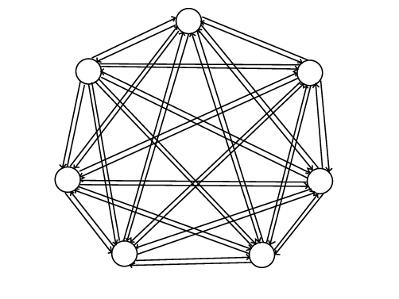

신경계에서 뉴런의 특징은 자극이 임계치가 넘으면 흥분하고, 그 이하는 억제된다. 홉필드 모델은 이러한 특성을 모방하기 위해 Hard limt non-linearity function을 사용하였는데, 이 함수는 입력값이 양수면 +1, 음수면 -1인 소위 계단함수를 사용하고 있다.

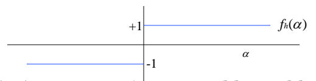
<br><br>

$$ 
Y^{sign}
\begin{cases} 
+1,  & \text{if $X > 0$} \\
-1, & \text{if $X < 0$} \\
0, & \text{if $X == 0$}
\end{cases}
$$

위는 단순화 한 수식이다.<br>
홉필드 네트워크는 이러한 단순 임계값 이론에 기초하고 있으며, 이는 연상기억 문제의 최적화에 아주 유용하다.
홉필드 모델의 제한점은 입력노드의 수에 따라 분류에 필요한 클래스, 즉 패턴의 수에 제한이 있다. 가장 이상적인 패턴의 수는 노드의 수의 15% 이하이다.

$$N * 0.15 > P$$ 

## 연상 메모리
연상메모리는 딥러닝의 기초로 생각하고 있다. 인간의 관점에서, 우리는 지금까지 자라오며 어떠한 "물건"에 대해서 학습해왔다. 예를 들어, 사과그림을 보면 사과를 떠오른다던지. 또한 그렇게 사과 이미지를 알고 있기 때문에, 인간은 사과의 이미지 일부만 봐도 사과인 것을 알아본다. <br>
기계의 관점에서 학습이란 _가중치(weight 값)를 조절하는 과정_ 이며, 외부에서 교사신호(Teaching Input)로써 입력신호에 대한 정답출력을 주는 학습방법인 **교사학습**(Supervised Learning)과 일일이 교사 신호를 주지 않는 학습방법인 **무교사학습**(Unsupervised Learning)이 있다.

$$ 
E(t) = -\frac12\sum_{i \ne j}w_{ij}o_io_j(t) - \sum_i\theta_io_i(t) \text{($\theta:임계값$)}
$$

~~자세한 수식 설명은 생략하고 싶다... 수식만 보면 머리가 아퍼~~

위의 수식은 연상메모리를 에너지 개념으로 설명한 수식이며, $o_i$는 노드의 출력을 의미하며 0 또는 1의 값을 취하고, $\theta$는 임계값을 의미한다. $E$는 발산되는 에너지 값이다.<br>
이 수식을 그래프로 표현하면 아래와 같다.

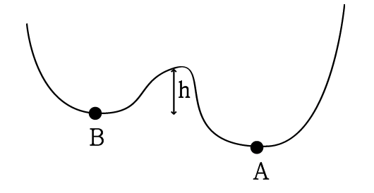

위 그림에서 x축은 상태, 즉 i,j 값을 나타내며, y축은 발산되는 에너지 양을 나타낸다. 상태가 전진됨에 따라가다보면 최소점을 찾을 수가 있는데, 이를 **극소점**이라 한다. 우리는 가중치 값 $w_{ij}$과 임계점 $\theta$을 이용하여 이 극소점을 찾는것을 목표로 한다. 즉 발산되는 에너지가 최소되는 지점을 찾기 위해 상태를 전진시키는 "**학습**"이 필요하다. 만약 학습이 제대로 되지 않는다면 A라는 최소점을 두고서도 B라는 최소점에서 만족해버릴지도 모른다. 이 최소점을 찾아나서는 과정에서 $w_{ij}$을 조정하는 것이 바로 학습이다. 이 에너지 함수 개념 때문에 minimun에 가까운 패턴이어야 정확한 분류가 가능하다.

## 연상 메모리 구현
이제 본방인 연상메모리 구현을 파이썬으로 구현해 보았다.<br>
실습 내용은 10x10 픽셀로 된 한글 14글자의 패턴을 학습시켜 임의의 입력값에 대해 출력값을 수정하는 연상메모리 구현이다.<br>
처음에는 '가'부터 '하'까지 14글자를 학습시키려 했으나, 모음 'ㅏ'가 계속 중복되는게 거슬려서 모음 순서도 진행시키로 했다.<br>
즉 아래와 같은 글자를 아래 그림의 패턴과 같이 학습시킨다.<br>
**가, 내, 댜, 럐, 머, 베, 셔, 예, 조, 쵸, 쿠, 튜, 프, 히**

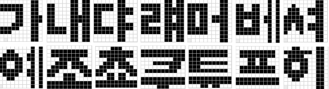

써놓고 보니 웃기긴 한데, 위의 학습이 제대로만 된다면 모든 한글 음절에 대해서 학습도 가능할 것이다.<br>
파이썬 소스코드는 다음과 같다.

```python

from tkinter import *
import copy

NODE = 11


class HopfieldNetwork:
    input = []
    weight = []
    node_count = 0
    try_count = 5

    def __init__(self, row_count, column_count):
        self.node_count = row_count * column_count
        self.input = [0] * self.node_count
        self.weight = [[0] * (self.node_count * self.node_count) for j in range(self.node_count * self.node_count)]

    def learn_hopfield(self, filename, input_list):
        # 1. 패턴을 학습하며 가중치를 조정한다.
        pattern_list = self.learn_weight(filename)
        if pattern_list is None:
            return None
        if not self.copy_input(input_list):
            return None

        # 2. 반복문을 돌면서 일치하는 패턴이 있으면 리턴한다.
        for step in range(0, self.try_count):
            print(step)
            # 3. 출력값을 조정한다.
            output_list = self.transfer_input_to_output()

            if self.check_match(pattern_list, output_list):
                return output_list
            self.copy_input(output_list)
        return None

    def copy_input(self, input_list):
        if len(input_list) != self.node_count:
            return False
        self.input = copy.deepcopy(input_list)
        return True

    def learn_weight(self, filename):
        try:
            # 클래스를 파일로 학습시킨다
            pattern_list = []
            f = open(filename, 'r')
            while True:
                line = f.readline().replace(" ", "").replace("\n", "").replace("\r", "")
                if line is None or len(line) == 0:
                    break

                # 패턴 라인 맨 앞이 x라면 읽지 않음 (테스트용 코드)
                if line[0] == 'x':
                    continue

                data = list(line)

                # 양극화
                for i in range(0, len(data)):
                    if data[i] == "0":
                        data[i] = -1
                    else:
                        data[i] = 1

                pattern_list.append(data)
            f.close()

            # weight 행렬 연산
            for pattern in pattern_list:
                for i in range(0, self.node_count):
                    for j in range(0, self.node_count):
                        if i == j:
                            self.weight[i][j] = 0
                            continue
                        self.weight[i][j] += int(pattern[i]) * int(pattern[j])

            return pattern_list

        except:
            return None

    def transfer_input_to_output(self):
        # 전이 함수에 대입
        output_list = [0] * self.node_count
        for i in range(0, self.node_count):
            tmp = self.input[i]
            for j in range(0, self.node_count):
                tmp += (self.input[j] * self.weight[i][j])

            # 계단함수 적용
            if tmp > 0:
                tmp = 1
            elif tmp < 0:
                tmp = -1

            output_list[i] = tmp

        return output_list

    def check_match(self, pattern_list, output_list):
        for pattern in pattern_list:
            if pattern == output_list:
                return True
        return False


def main():
    def toggle_color(event):
        background = "black" if event.widget['bg'] == 'white' else "white"
        event.widget.configure(background=background)

    def on_click_clear():
        canvas.delete(ALL)
        msg.config(text="")
        for button_obj in button_list:
            button_obj.config(bg="white")

    def on_click_input():
        canvas.delete(ALL)
        msg.config(text="")
        hopfield = HopfieldNetwork(NODE, NODE)

        input_list = [0]*NODE*NODE
        for i in range(0, len(button_list)):
            if button_list[i]['bg'] == 'white':
                input_list[i] = -1
            else:
                input_list[i] = 1
        input_flat = input_list
       # input_flat = list(itertools.chain.from_iterable(Input))
        while True:
            try:
                index = input_flat.index(0)
            except:
                break

            input_flat[index] = -1
        output_list = hopfield.learn_hopfield("./pattern.txt", input_flat)
        print(output_list)
        if output_list is None:
            msg.config(text="No pattern matched", fg="red")
            return

        length = 30
        for i in range(0, len(output_list)):
            offset = i * length
            x1 = (offset % 330) + (i % 11) * 5
            y1 = int(offset / 330) * (length + 5)
            x2 = x1 + length
            y2 = y1 + length

            if output_list[i] == 1:
                color = "#000000"
            else:
                color = "#ffffff"

            canvas.create_polygon(x1, y1, x2, y1, x2, y2, x1, y2, outline=color, fill=color)
        msg.config(text="Pattern found!", fg="blue")
        #canvas.pack()

    root = Tk()
    root.title('Hopfield Network Example - 201333543 박현국')
    root.geometry('1050x600+10+10')
    root.resizable(False, False)
    dummy = Label(root, text="\t\n")
    dummy.grid(row=0, column=0)

    button_list = []
    for i in range(0, NODE):
        for j in range(0, NODE):
            button = Button(root, background="white", height=1, width=1)
            button.grid(row=i+1, column=j+1)
            button.bind("<Button-1>", toggle_color)
            button_list.append(button)

    dummy2 = Label(root, text="   ")
    dummy2.grid(row=int(NODE / 2), column=NODE+1)
    input_button = Button(root, text="입력", command=on_click_input)
    input_button.grid(row=int(NODE / 2), column=NODE + 2)
    arrow = Label(root, text="=======>", font=("Courier", 15))
    arrow.grid(row=int(NODE / 2)+1, column=NODE + 2)
    clear_button = Button(root, text="초기화", command=on_click_clear)
    clear_button.grid(row=int(NODE / 2)+2, column=NODE + 2)
    canvas = Canvas(root, width=380, height=380)
    canvas.place(x=590, y=45)
    msg = Label(root, text="", fg="red")
    msg.place(x=450, y=500)
    root.mainloop()


if __name__ == '__main__':
    main()

```

패턴은 아래와 같이 학습시켰다. 원래는 0이 아니라 -1이 맞지만 입력하기 편하게 0으로 표현했다(읽어들이면서 바꾸면 되니까..). 

```
# 순서대로 가, 내, 댜, 럐, 머, 베, 셔, 예, 조, 쵸, 쿠, 튜, 프, 히
00000000110 11111100110 11111100110 00001100110 00001100111 00001100111 00011100110 11111000110 11100000110 00000000110 00000000110
00000011011 11000011011 11000011011 11000011011 11000011111 11000011111 11000011011 11111011011 11111011011 00000011011 00000011011
00000011000 11111011000 11111011110 11000011110 11000011000 11000011000 11000011110 11111011110 11111011000 00000011000 00000011000
00000011011 11111011011 11111011111 00011011111 11111011011 11111011011 11000011111 11111011111 11111011011 00000011011 00000011011
00000000110 11111000110 11111000110 11011000110 11011011110 11011011110 11011000110 11111000110 11111000110 00000000110 00000000110
00000000101 11001100101 11001100101 11111100101 11111101101 11001101101 11001101101 11111100101 11111100101 00000000101 00000000101
00000000110 00100000110 01110011110 01110011110 11111000110 11111000110 11011011110 11011011110 10001000110 00000000110 00000000110
00000000101 00110000101 01111001101 11111101101 11001100101 11001100101 11111101101 01111001101 00110000101 00000000101 00000000101
00000000000 01111111110 01111111110 00011111000 00111011100 01111011110 11100000111 11001110011 00001110000 11111111111 11111111111
00001110000 01111111110 01111111110 00011111000 00111011100 01111011110 11100000111 11011011011 00011011000 11111111111 11111111111
00000000000 11111111111 11111111111 00000000111 00011111110 00000001110 01111111100 00000000000 11111111111 11111111111 00001110000
00000000000 11111111110 11111111110 11100000000 11111111110 11100000000 11111111110 00000000000 11111111111 11111111111 00011011000
00000000000 01111111110 01111111110 00011011000 00011011000 01111111110 01111111110 00000000000 11111111111 11111111111 00000000000
00110000110 11111110110 01111000110 11111100110 11001100110 11001100110 11111100110 01111000110 00110000110 00000000110 00000000110
```

실행 화면은 다음과 같다.

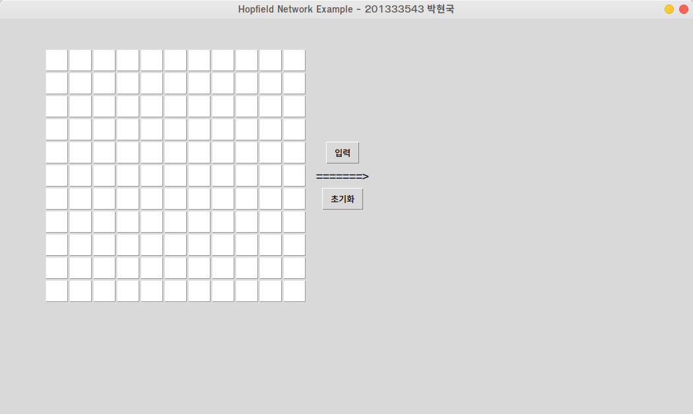

먼저, 학습이 제대로 되었는지를 확인하기 위해 **"가"** 글자 하나를 정확하게 입력하였다.

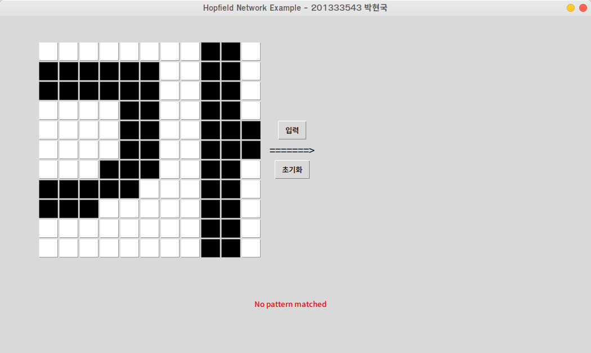

어라? 패턴을 찾지 못했다. 분명히 정확하게 입력했는데.... 소스코드가 잘못된 걸까. 디버깅을 3시간동안 돌려봤지만, 몇군데 자잘한 오류를 제외해도 해결되지 않았다. <br><br>
혹시나 싶어서 패턴을 위의 입력 패턴에서 위에서 4개만 넣어보았다.

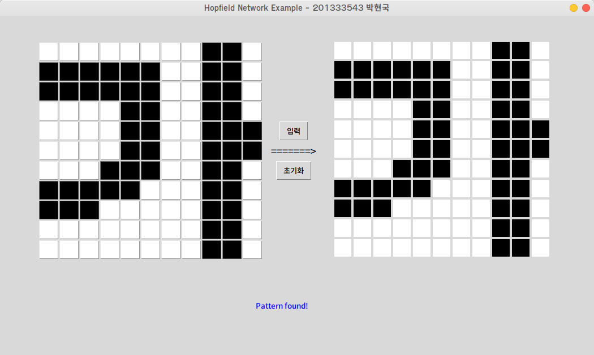

헐~ 잘된다. 

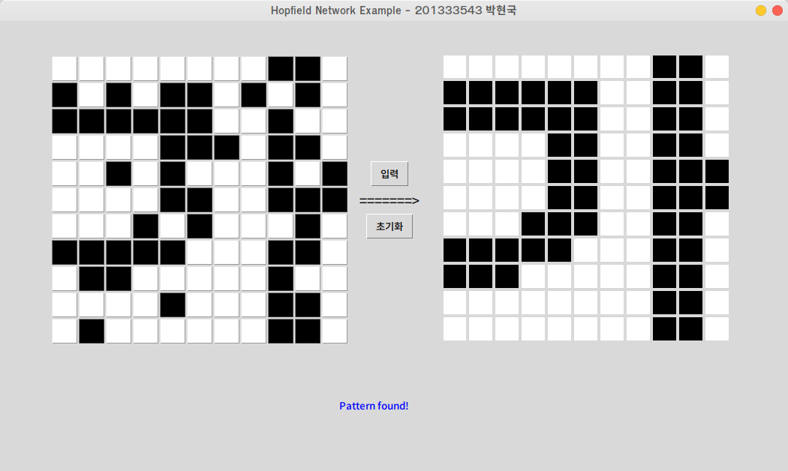

심지어 노이즈를 삽입해도 잘 연상해 내는것을 확인할 수 있었다. 원인은 소스코드가 아닌 학습하는 패턴에 있었다. ~~3시간의 디버깅이 공중분해 되었다...~~

처음에는 패턴을 너무 많이 입력해서 연상을 못하는건가 싶었지만, 패턴의 수 $P$는 14이고 노드의 수 $N$은 11x11인 121, 즉 $N * 0.15 > P$ 를 만족한다.<br>
또한, 패턴의 입력값을 무작위로 삭제하면서 추가해보니, 같은 패턴들이 학습된 상태에서 어떤 패턴은 연상됬지만 어떤 패턴은 전혀 연상되지 못했다.

결국 내가 내린 결론은 **학습된 여러개의 비슷한 패턴 중 minimum한 패턴을 찾지 못하는것**이었다. 패턴간에 겹치는 부분이 많다보니, 그 부분에 대해서는 연상이 제대로 이루어지지 못한 것 같다. 추가로 디버깅을 좀 해보니, 출력값을 잡아가는 과정에서 패턴 노드 중 몇 가지만 정해지지 못하고 계속해서 1과 -1을 왔다갔다 거림을 확인할 수 있었다.

이 문제를 해결하려면 노드의 수를 더 추가시켜, 최대한 글자패턴이 서로 비슷하지 않게 찍어내야 한다. 그러나 지금 시점에서 노드의 수를 더 늘이거나, 새로운 패턴을 설계하기에는 시간과 컴퓨터 자원의 소모가 너무 컸기에, 결국 패턴을 일일이 삭제하면서 어떤 패턴의 조합이 가장 이상적인지를 찾아내었다.

```
# 가, 내, 댜, 베, 튜, 프
00000000110 11111100110 11111100110 00001100110 00001100111 00001100111 00011100110 11111000110 11100000110 00000000110 00000000110
00000011011 11000011011 11000011011 11000011011 11000011111 11000011111 11000011011 11111011011 11111011011 00000011011 00000011011
00000011000 11111011000 11111011110 11000011110 11000011000 11000011000 11000011110 11111011110 11111011000 00000011000 00000011000
00000000101 11001100101 11001100101 11111100101 11111101101 11001101101 11001101101 11111100101 11111100101 00000000101 00000000101
00000000000 11111111110 11111111110 11100000000 11111111110 11100000000 11111111110 00000000000 11111111111 11111111111 00011011000
00000000000 01111111110 01111111110 00011011000 00011011000 01111111110 01111111110 00000000000 11111111111 11111111111 00000000000
```

이 패턴들에 대해서는 연상을 성공적으로 해내는 것을 확인할 수 있었다.


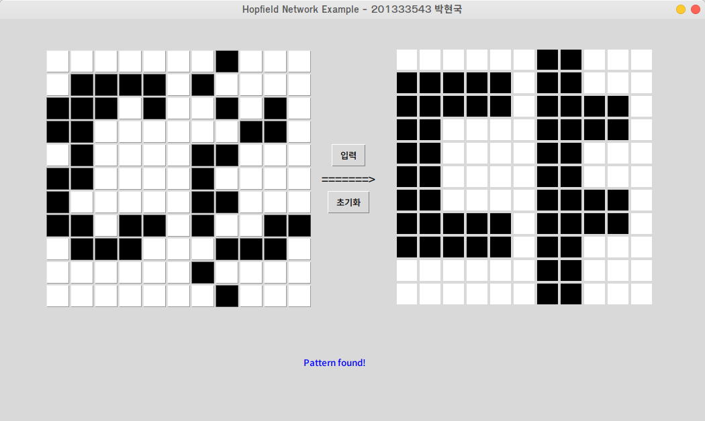
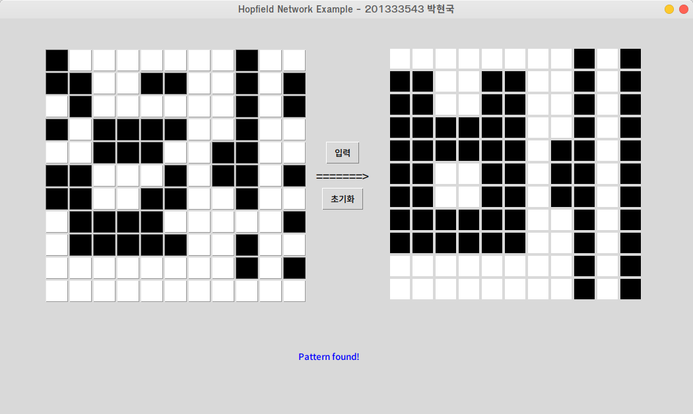
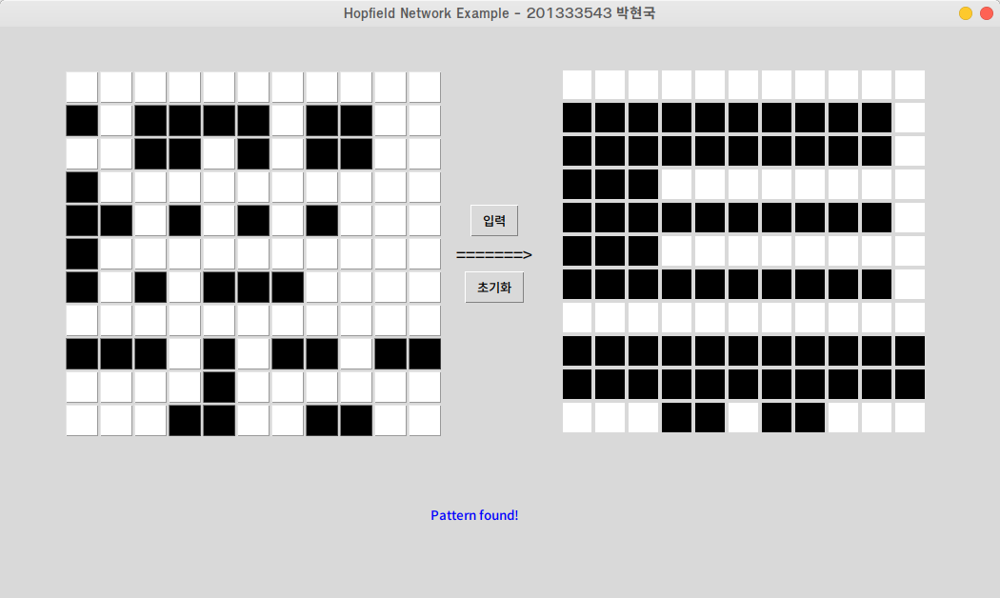
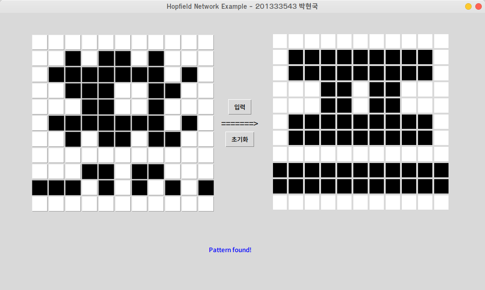

## 어려웠던 점
- 가중치값 등 무수히 많은 행렬의 계산을 직접 하기가 어려웠다.
- 프로그램적으로는 오류없이 잘 돌아가지만, 내부에서 수식의 계산이 제대로 이루어졌는지 검증을 직접 해야해서 시간이 많이 들었다.
- 특정 패턴이 연상이 잘 되지 않았다.
- $n * 0.15 > p$ 이라고 알고 있었지만, 이건 이론상의 수치일 뿐 실제와는 다르다는걸 느꼈다.

## 실험 후기
 처음 홉필드 모델을 들었을때는 생소해서 어렵다고 느꼈지만, 막상 수업 ppt에 나와있는 구현 예제를 보니 구현이 그렇게 어렵지 않겠다고 생각했다. 사실 처음에는 45x45 노드로 학습을 시키려 했었다. 그러나 입력, 출력을 console로 하면 모를까, gui환경에서 하기에는 속도가 너무 느렸고 실험하기 불편하게 느껴졌다. 그래서 노드의 수를 11x11로 줄여서 실험했는데, 그 때문에 비슷한 패턴이 많이 생기는 바람에 연상이 잘 되지 않아서 고민을 많이 하게 되었다. 좀 더 노드를 늘려서 테스트 해보았으면 보다 더 성공적인 연상에 성공했을 거 같다는 생각이 들어 많이 아쉬웠다. 나중에 시간이 허락해 준다면 개인적으로 좀 더 많은 노드의 수를 console 환경에서 실습해봐야겠다고 생각했다. 결국 연상에 성공해 냈을때는 뭔가 인공지능의 첫 걸음을 떼었다는 쾌감이 들었고, 이 쾌감을 새로운 신경망을 설계할 때마다 느끼고 싶다는 생각이 들었다.